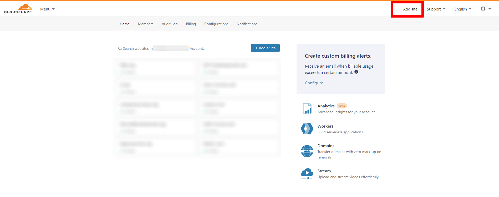

Red Commander
=========

Creates two Cobalt Strike C2 servers (DNS and HTTPS), with redirectors, and RedELK in Amazon AWS. Minimal setup required!

#Important!
This build does **NOT** use free-tier eligible servers. Approximate costs can vary. During testing, we used six ec2 instances that cost around $70/month total.

## <span style="color:red;background-color:black;"> Please read all of this Readme. </span>
I spent a ton of time ensuring that as many questions as I could think of were answered. If I missed something, please feel free to reach out. But if it's here, I'm going to tell you to RTFM :)

Features
--------

* Build out multiple engagements with this platform! Tracking via Engagement ID
* Custom Cobalt Strike Package Support
* Custom MalleableC2 Support per C2
* C2Concealer Support (Test 👏 Your 👏 Profiles!)
* Modified cs2modrewrite.py from [Threat Express](https://github.com/threatexpress/cs2modrewrite)
* Joomla Support for Web Redirectors. (The web redirectors can have their own website!)
* Launch as many Web Redirectors as you want! Add as needed by rerunning the playbook with more domains added.
* Custom EDR Evasion support via Web Redirectors (thanks to [@curi0usJack](https://twitter.com/curi0usJack))

Customization Notes
---
Name the folders below labeled "web-redir1.org", "web-redir2.com" to whatever the domain name is for that web redirector. This will ensure that the correct Joomla install lands on the right EC2 server!
For Example:

If you created a decoy joomla site "definitely-legit-company.com" and wanted to use it as a web redirector, ensure it's in the 'domains' variable, and name a folder in the `files/` directory 'definitely-legit-company.com' with `dump.sql` and `joomla.zip` in that folder that correspond to that site. Details on how to do that are below.

```
/opt/redcommander/files
│   C2concealer.zip
│   cobaltstrike.zip
│   cs2modrewrite.py
│   RedELK.zip
│   redirect.rules
│
├───web-redir1.org
│       dump.sql
│       joomla.zip
│
├───web-redir2.com
│       dump.sql
│       joomla.zip
│
└───custom
    ├───DNS
    │       evasive.profile
    │       keystore.store
    │
    └───HTTPS
            evasive.profile
            keystore.store
```
#### Details
All files have to be named EXACTLY as shown above in the folders shown. The exception is naming the folder for the web redirect domains.
* Add your own cobaltstrike.zip file if you like. Don't include your MalleableC2 profile in that ZIP, though.
* If you don't include a Keystore, one will be created for you using the LetsEncrypt certificate generated for the C2 domain.
* If you don't include a MalleableC2 profile, one will be generated for you. This happens at every run, so it's likely a good idea to copy the generated keystore/profile to the above directories after first run, or just build your own.
* To dump the MySQL database of your Joomla site, use `mysqldump`
 Example: `mysqldump -u root -p -d cs_joomla >> dump.sql`
 Then, execute `cd /var/www/html; zip -r joomla.zip *` to get your Joomla install zipped properly. Don't worry, the play will add the correct configuration settings (by default, mysql password, user and session type modifiers)
* You can add a custom Cobalt Strike MalleableC2 and/or Keystore per C2 to `files/custom/DNS` and `files/custom/HTTPS` respectively.

Requirements
------------

### Ansible Control Node Requirements

* python3
* python3-boto3
* python3-botocore
* python3-requests
* Ansible (obviously)

### Variable Requirements

* Amazon AWS API keys. You will need to be able to create EC2 Instances, VPCs, Subnets, IGW, Routing Tables, CloudFront Distributions (wasn't working properly in tests), and Add Keypairs.
* CloudFlare API Credentials
* Paid Cobalt Strike License (A Trial doesn't work here.)
* VirusTotal API Credentials (optional)
* Hybrid-Analysis API Credentials (optional)
* IBM-X-FORCE Red API Credentials (optional)
* Email Address for sending alert emails (We used Gmail)

The only **REQUIRED** pre-requisite that's not included in the variables file is to add your campaign domains to CloudFlare. The simple steps for that are:

* Buy a domain
* Assign Domain DNS servers to CloudFlare (for us it's `marek.ns.cloudflare.com` and `nora.ns.cloudflare.com`)
* Login to CloudFlare and click "Add Site"
 
* Add your site name
* Select Free for the Plan
* Don't import any DNS records
* Repeat for all needed domains

**Important!** Please be kind to CloudFlare. Send an email to [abuseteam@cloudflare.com](abuseteam@cloudflare.com) stating your AUTHORIZED intentions.

Variables
----------
All variables except the Vault key are covered in `vars/main.yml`. Please reference that file for descriptions of each variable. **USE ANSIBLE VAULT FOR SENSITIVE DATA!**

Example:

`ansible-vault encrypt_string --vault-password-file /path/to/password/file --name 'aws_secret_key'`

Usage
----------------
We usually run this directly from the control node, though I'm in the process of importing this to AWX.

**Important!** Ensure that your variables are correct before running the playbook!

`ansible-playbook playbook.yml --ask-vault-pass`

I created a janky output.yml play that will spit out IP/Hostname correlations in debug. It's not pretty, but I left it in case you don't have access to AWS EC2 web gui.

There's also a nuke playbook for destroying your infrastructure. It's run the same way:

`ansible-playbook nuke.yml --ask-vault-pass`

Run that at your own risk.

FAQ
---

- _My Payload isn't calling back!!!_

 Check 👏 Your 👏 Profile

- _I don't see any data in RedELK!_
 
 Ensure that all variables were correctly added. Check `/var/log/redelk` logs for errors in the RedELK server. Otherwise check the [RedELK Wiki](https://github.com/outflanknl/RedELK/wiki). Oh, and make sure you have a live beacon. Otherwise you likely won't have any data! :)

- _I'm getting an Error in the Ansible Build!_

 Where? Try running it again with -vvv. Generally the Python Traceback will tell you whats wrong.

Author Information
------------------
Alex Williams, OSCP, GXPN

Twitter: [@offsec_ginger](https://twitter.com/offsec_ginger)

Github: [offsecginger](https://github.com/offsecginger)

Special Thanks
---
(In no particular order)

- Outflank ([RedELK](https://github.com/outflanknl/RedELK))
- Jason Lang ([RedELK Ansible Automation](https://github.com/curi0usJack/ansible-redelk))
- Threat Express ([CSModRewrite.py](https://github.com/threatexpress/cs2modrewrite))
- Rafael Mudge ([Cobalt Strike](https://twitter.com/armitagehacker))
- Joaquim Nogueira ([Ansible Assistance](https://twitter.com/lkys37en))
- FortyNorthSecurity ([C2Concealer](https://github.com/FortyNorthSecurity/C2concealer))